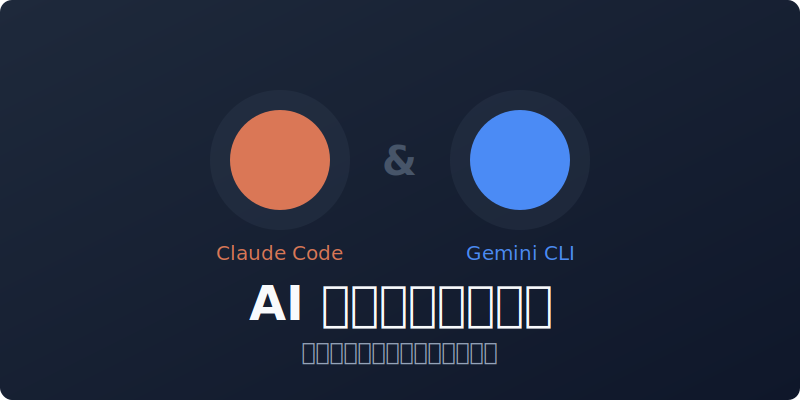

<div align="center">

# AI 编码助手配置中心

<!-- 封面图 -->


> 让 Claude Code 和 Gemini CLI 开箱即用的配置模板
>
> 按费力度从低到高，用最少操作获得最大帮助

[](https://github.com/doccker/cc-use-exp)
[](./LICENSE)
[](https://docs.anthropic.com/claude-code)
[](https://github.com/google-gemini/gemini-cli)
[](https://github.com/doccker/cc-use-exp/pulls)

</div>

---

<details>
<summary><strong>📑 目录导航</strong></summary>

- [项目定位](#项目定位)
- [快速部署](#快速部署)
- **Part 1: Claude Code**
  - [快速开始](#1-快速开始)
  - [常见场景速查](#2-常见场景速查)
  - [目录结构](#5-目录结构)
- **Part 2: Gemini CLI**
  - [快速开始](#1-快速开始-1)
  - [前端场景速查](#2-前端场景速查)
- [社区与支持](#社区与支持)
- [许可声明](#许可声明)

</details>

---

## 项目定位

### 使用架构

```
本项目                      用户目录                    其他项目
├── .claude/  ──覆盖──>    ~/.claude/  <──读取──      .claude/ (空)
└── .gemini/  ──覆盖──>    ~/.gemini/  <──读取──      .gemini/ (空)
```

- **本项目**：配置开发/维护环境，不参与实际业务开发
- **用户目录**：实际生效的配置
- **其他项目**：配置目录为空，自动使用用户目录配置

### 两套配置的关系

| 目录 | 服务对象 | 说明 |
|------|---------|------|
| `.claude/` | Claude Code | Anthropic 的 CLI 工具 |
| `.gemini/` | Gemini CLI | Google 的 CLI 工具 |

**两者完全独立**：
- Claude Code 只读取 `~/.claude/`，不读取 `~/.gemini/`
- Gemini CLI 只读取 `~/.gemini/`，不读取 `~/.claude/`
- 配置内容可能相似（如禁止行为、技术栈偏好），但这不是重复，而是各自需要的独立配置

### 配置能力差异

| 特性 | Claude Code | Gemini CLI |
|------|-------------|------------|
| 主配置文件 | `.claude/CLAUDE.md` | `.gemini/GEMINI.md` |
| 规则目录 | `.claude/rules/` ✅ | 不支持 ❌ |
| 技能目录 | `.claude/skills/` ✅ | 不支持 ❌ |
| 命令目录 | `.claude/commands/` (.md) | `.gemini/commands/` (.toml) |
| 命令格式 | Markdown | TOML |

**规则同步方式**：
- Claude Code：规则拆分到 `rules/` 目录，按文件组织
- Gemini CLI：所有规则必须写在 `GEMINI.md` 一个文件中

> 如需在两个工具间同步规则（如禁止行尾注释），需分别在 `.claude/rules/bash-style.md` 和 `.gemini/GEMINI.md` 中维护。

---

## 支持的工具

| 工具 | 配置目录 | 部署位置 | 状态 |
|------|---------|---------|------|
| Claude Code | `.claude/` | `~/.claude/` | ✅ 完整支持 |
| Gemini CLI | `.gemini/` | `~/.gemini/` | ✅ 基础支持 |

---

## 快速部署

### 一键同步（推荐）

**macOS/Linux**：
```bash
./sync-config.sh
```

**Windows**：
```cmd
sync-config.bat
```

脚本会自动将 `.claude/` 和 `.gemini/` 同步到用户根目录（`~/.claude/` 和 `~/.gemini/`），文件冲突时提供以下选项：

| 选项 | 按键 | 说明 |
|------|------|------|
| 覆盖当前文件 | `y` | 仅覆盖这一个 |
| 跳过当前文件 | `N` 或回车 | 默认，仅跳过这一个 |
| 全部覆盖 | `a` | 后续所有文件都覆盖 |
| 全部跳过 | `s` | 后续所有文件都跳过 |

### 手动部署

<details>
<summary><strong>Claude Code</strong></summary>

```bash
# 只覆盖配置目录，保留历史记录
rm -rf ~/.claude/rules ~/.claude/skills ~/.claude/commands ~/.claude/templates ~/.claude/tasks
cp -r .claude/rules ~/.claude/
cp -r .claude/skills ~/.claude/
cp -r .claude/commands ~/.claude/
cp -r .claude/templates ~/.claude/
cp -r .claude/tasks ~/.claude/
cp .claude/CLAUDE.md ~/.claude/
```
</details>

<details>
<summary><strong>Gemini CLI</strong></summary>

```bash
# 只覆盖配置，保留认证信息
rm -rf ~/.gemini/commands
cp -r .gemini/commands ~/.gemini/
cp .gemini/GEMINI.md ~/.gemini/
cp .gemini/settings.json ~/.gemini/
```
</details>

> **注意**：Claude Code 的 `~/.claude/` 包含历史记录（`history.jsonl`、`projects/` 等），不能整体删除，只覆盖配置目录。Gemini CLI 的 `~/.gemini/` 包含认证信息（`oauth_creds.json`、`google_accounts.json`），同样只覆盖配置。

---

# Part 1: Claude Code 配置

---

## 1. 快速开始

### 1.1 零费力（自动生效）- Rules

**你需要做什么：什么都不用做**

这些规则始终自动加载，在后台默默保护你：

| 规则 | 作用 | 触发场景 |
|------|------|---------|
| `claude-code-defensive.md` | 防止测试篡改、过度工程化、中途放弃 | 始终生效 |
| `ops-safety.md` | 危险命令确认、回滚方案、风险提示 | 始终生效（详细规范见 skills） |
| `doc-sync.md` | 配置/结构变更时提醒更新文档 | 修改配置时 |
| `bash-style.md` | Bash 核心规范：禁止行尾注释 | 始终生效（详细规范见 skills） |

**效果示例**：
- Claude 不会修改测试来适配错误代码
- 执行 `sysctl` 等危险命令前会提示风险和回滚方案
- 新增命令后会提醒你更新 README

### 1.2 低费力（自动触发）- Skills

**你需要做什么：正常写代码**

操作相关文件时自动加载对应的开发规范：

| 技能 | 触发条件 | 提供的帮助 |
|------|---------|-----------|
| `go-dev` | 操作 `.go` 文件 | 命名约定、错误处理、并发编程、测试规范 |
| `java-dev` | 操作 `.java` 文件 | 命名约定、异常处理、Spring 规范、不可变集合、线程池、代码模式 |
| `frontend-dev` | 操作 `.vue/.tsx/.css` 等 | UI 风格约束、Vue/React 规范、TypeScript |
| `python-dev` | 操作 `.py` 文件 | 类型注解、Pydantic、pytest、uv 工具链 |
| `bash-style` | 操作 `.sh/Dockerfile/Makefile/.md` 等 | 注释规范、tee 写入、heredoc、脚本规范 |
| `ops-safety` | 执行系统命令、服务器运维 | 风险说明、回滚方案、问题排查原则 |

**效果示例**：
- 写 Go 代码时，自动遵循 Effective Go 规范
- 写 Vue 组件时，自动使用 Composition API + TypeScript
- 不操作这些文件时，不消耗额外 token

### 1.3 中费力（显式调用）- Commands

**你需要做什么：输入 `/命令名`**

#### 高频命令（日常使用）

| 命令 | 用途 | 使用示例 |
|------|------|---------|
| `/fix` | 快速修复 Bug | `/fix 登录接口返回 500` |
| `/quick-review` | 快速审查（git diff + 简要意见） | `/quick-review` |
| `/code-review` | 正式代码审查 | `/code-review` |
| `/debug` | 复杂问题排查（复现→假设→验证→修复） | `/debug 定时任务不执行` |
| `/commit-msg` | 生成 git commit message | `/commit-msg` 或 `/commit-msg all` |

#### 中频命令（按需使用）

| 命令 | 用途 | 使用示例 |
|------|------|---------|
| `/security-review` | 安全审查当前分支代码 | `/security-review` |
| `/new-feature` | 新功能全流程（需求→设计→实现） | `/new-feature 用户导出功能` |
| `/design-doc` | 生成技术设计文档框架 | `/design-doc 用户权限模块` |
| `/requirement-doc` | 生成需求文档框架 | `/requirement-doc 报表功能` |

#### 低频命令（特定场景）

| 命令 | 用途 | 使用示例 |
|------|------|---------|
| `/requirement-interrogate` | 需求极刑审问，挖掘逻辑漏洞 | `/requirement-interrogate 用户要导出数据` |
| `/design-checklist` | 生成设计质量检查清单 | `/design-checklist` |
| `/project-init` | 为新项目初始化 Claude Code 配置 | `/project-init` |
| `/project-scan` | 扫描项目生成配置（CLAUDE.md/restart.sh/ignore/Docker） | `/project-scan` |
| `/style-extract` | 从代码或设计图提取样式变量 | `/style-extract` |
| `/ruanzhu` | 生成软著源代码 DOCX 文件 | `/ruanzhu "系统名称" 60` |
| `/status` | 显示当前配置状态（Rules/Skills/LSP） | `/status` |

---

## 2. 常见场景速查

| 场景 | 推荐方式 | 费力度 |
|------|---------|--------|
| 日常写代码 | 直接写，Rules + Skills 自动生效 | ⭐ |
| 修个小 Bug | `/fix 问题描述` | ⭐⭐ |
| 提交前快速看看 | `/quick-review` | ⭐⭐ |
| 生成 commit message | `/commit-msg` | ⭐⭐ |
| 正式代码审查 | `/code-review` | ⭐⭐ |
| 复杂 Bug 排查 | `/debug 问题描述` | ⭐⭐⭐ |
| 安全审查 | `/security-review` | ⭐⭐⭐ |
| 开发新功能 | `/new-feature 功能名` | ⭐⭐⭐ |
| 新项目初始化 | `/project-init` | ⭐⭐⭐ |

```
遇到 Bug？
├─ 简单 Bug → /fix 问题描述
└─ 复杂 Bug → /debug 问题描述

代码审查？
├─ 快速看看 → /quick-review
├─ 正式审查 → /code-review
└─ 安全审查 → /security-review

新功能？
├─ 完整流程 → /new-feature 功能名
└─ 只要设计 → /design-doc 模块名
```

---

## 3. 最佳实践

### 3.1 让自动化为你工作

- **不要干预 Rules**：它们在后台保护你，比如防止 Claude 修改测试
- **不要手动加载 Skills**：操作相关文件时自动生效
- **相信防御机制**：复杂任务会自动要求确认计划后再执行

### 3.2 避免的做法

- ❌ 不要绕过 Rules 的保护机制
- ❌ 不要在简单任务上使用复杂命令
- ❌ 不要忽略文档同步提醒

---

## 4. 常见问题

### Q: 为什么 Claude 总是先说明计划再执行？

A: 这是 `claude-code-defensive.md` 规则的要求。复杂任务（超过 3 个步骤或涉及多个文件）必须先说明计划，等你确认后再执行。这是为了防止 Claude 盲目修改代码。

### Q: 为什么执行系统命令时 Claude 会问很多问题？

A: 这是 `ops-safety.md` 规则的要求。危险命令（如 sysctl、iptables）必须说明影响范围、风险等级和回滚方案。这是为了防止误操作导致系统故障。

### Q: 为什么 Claude 提醒我更新文档？

A: 这是 `doc-sync.md` 规则的要求。当你修改了配置（commands/skills/rules）或项目结构时，会提醒你同步更新相关文档，保持文档与代码一致。

### Q: 如何添加新的语言支持？

A: 在 `.claude/skills/` 下创建新目录（如 `rust-dev/`），添加 `SKILL.md` 文件定义触发条件和规范内容，然后更新本文档。

---

## 5. 目录结构

```
.claude/
├── CLAUDE.md                     # 核心配置：身份、偏好、技术栈
├── rules/                        # 规则：始终加载（精简版）
│   ├── claude-code-defensive.md  # 防御性规则
│   ├── ops-safety.md             # 运维安全（核心）
│   ├── doc-sync.md               # 文档同步
│   └── bash-style.md             # Bash 核心规范
├── skills/                       # 技能：按需加载（完整版）
│   ├── go-dev/
│   ├── java-dev/
│   ├── frontend-dev/
│   ├── python-dev/
│   ├── bash-style/               # Bash 完整规范
│   ├── ops-safety/               # 运维安全完整规范
│   └── ruanzhu/                  # 软著源代码生成
├── commands/                     # 命令：显式调用
│   ├── fix.md
│   ├── code-review.md
│   ├── debug.md
│   ├── ruanzhu.md                # 软著源代码 DOCX 生成
│   ├── status.md
│   └── ...
└── templates/                    # 模板文件
    └── ruanzhu/                  # 软著生成脚本
```

### 核心概念

| 类型 | 加载时机 | 触发方式 | 适用场景 |
|------|---------|---------|---------|
| **Rules** | 始终加载 | 自动生效 | 核心约束、防御规则 |
| **Skills** | 按需加载 | 根据文件类型自动触发 | 语言规范、领域知识 |
| **Commands** | 调用时加载 | 用户输入 `/命令名` | 明确的工作流任务 |

### Rules 与 Skills 的关键区别

> **重要**：Rules 的 `paths` frontmatter 只是语义提示，**不影响加载**。

| 特性 | Rules | Skills |
|------|-------|--------|
| 加载时机 | 每次对话启动时**全部加载** | 启动时仅加载名称和描述 |
| 内容加载 | 完整内容立即加载 | 匹配时才加载完整内容 |
| `paths` 作用 | 条件应用（不节省 tokens） | N/A |
| Token 消耗 | 始终消耗 | 按需消耗 |

**最佳实践**：
- Rules 保持精简（核心禁止项），详细规范放 Skills
- 例如 `bash-style`：rules 放 37 行核心规则，skills 放 200+ 行完整规范

### 设计理念

1. **按需加载**：语言规范用 Skills，只在操作相关文件时加载，节省 tokens
2. **规则溯源**：每次回复声明依据的规则/技能，便于追踪和调整
3. **简洁优先**：CLAUDE.md 只放身份/偏好，具体约束放 rules

---

## 6. 开发指南

### LSP 服务器配置（v2.0.67+ 支持）

> **前提**：需安装 `@anthropic-ai/claude-code@2.0.67` 或更高版本。

#### 安装命令

```bash
# Go
go install golang.org/x/tools/gopls@latest

# TypeScript/JavaScript + Vue
npm install -g typescript typescript-language-server @vue/language-server

# Python
npm install -g pyright

# Java (macOS)
brew install jdtls
```

#### LSP 使用策略

LSP 的核心优势是"精准打击"——查找定义时只返回相关代码，而非整个文件，可节省大量 Token。

| 场景 | 建议 | 原因 |
|------|------|------|
| 查找定义/引用 | 优先用 LSP | 精准定位，节省 ~99% Token |
| 理解模块整体逻辑 | 读取完整文件 | 避免"管中窥豹"，获取完整上下文 |
| 大型项目导航 | LSP + 选择性读文件 | 混合策略最优 |

#### 注意事项

- **环境就绪**：使用前确保依赖已安装（`npm install` / `go mod download`）
- **避免过度依赖**：复杂逻辑需要读取完整文件上下文
- **LSP 失败时**：退回到读取文件的方式

### 修改现有配置

1. 在 `.claude/` 下修改对应文件
2. 在本项目目录启动 Claude Code 测试
3. 验证功能符合预期
4. 复制到 `~/.claude/` 正式使用

### 新增命令（Command）

1. 创建 `.claude/commands/<name>.md`
2. 编写 frontmatter（description）和内容
3. 测试 `/<name>` 命令
4. 更新本文档的命令列表

**命令模板**：

```markdown
---
description: 命令的简要描述
---

命令的详细说明和执行逻辑。

## 输入

「$ARGUMENTS」— 用户输入的参数

## 流程

### 第 1 步：...
### 第 2 步：...

## 输出格式

...
```

### 新增技能（Skill）

1. 创建 `.claude/skills/<name>/SKILL.md`
2. 编写 frontmatter（name、description）和内容
3. 可选：添加 `references/` 目录存放详细参考
4. 测试触发是否正确
5. 更新本文档的技能列表

**技能模板**：

```markdown
---
name: skill-name
description: 当用户操作 xxx 文件时触发。提供 xxx 开发规范。
---

# 技能名称

## 核心规范

...

## 详细参考

详细内容见 `references/` 目录。
```

### 测试验证

```bash
# 在本项目目录启动 Claude Code
cd /path/to/cc-use-exp
claude

# 测试命令
> /fix 测试问题

# 测试技能（操作相关文件类型）
> 帮我看看这个 Go 代码有什么问题

# 检查配置加载
> /memory
```

---

## 7. 部署方法

### 工作原理

```
本项目 .claude/  ──开发/优化──>  确认无误  ──覆盖配置目录──>  ~/.claude/
```

- 在本项目 `.claude/` 目录下开发和优化配置
- 确认无误后，**只覆盖配置目录**到 `~/.claude/`
- `~/.claude/` 中的历史记录（`history.jsonl`、`projects/` 等）会保留

### 配置目录 vs 运行时数据

| 类型 | 目录/文件 | 部署时 |
|------|----------|--------|
| 配置 | `rules/`, `skills/`, `commands/`, `templates/`, `tasks/`, `CLAUDE.md` | 覆盖 |
| 运行时 | `history.jsonl`, `projects/`, `todos/`, `settings.local.json` 等 | 保留 |

### 部署命令

```bash
# 只覆盖配置目录，保留历史记录
rm -rf ~/.claude/rules ~/.claude/skills ~/.claude/commands ~/.claude/templates ~/.claude/tasks
cp -r .claude/rules ~/.claude/
cp -r .claude/skills ~/.claude/
cp -r .claude/commands ~/.claude/
cp -r .claude/templates ~/.claude/
cp -r .claude/tasks ~/.claude/
cp .claude/CLAUDE.md ~/.claude/

# 验证部署
# 启动 Claude Code，执行 /status 确认配置加载正确
```

> **注意**：不要整体删除 `~/.claude/`，否则会丢失对话历史记录（`claude -c` 依赖）。

---

## 8. 版本记录

---

## 9. 参考资料
- [Claude Code 官方文档](https://docs.anthropic.com/claude-code)

---

# Part 2: Gemini CLI 配置（前端设计）

> **定位**：Gemini CLI 专注于前端设计和开发，技术栈为 Vue 3 + TypeScript + Element Plus。

---

## 1. 快速开始

### 1.1 零费力（自动生效）- GEMINI.md

**你需要做什么：什么都不用做**

GEMINI.md 自动加载，提供以下保护：

| 规则 | 作用 |
|------|------|
| UI 风格约束 | 禁止霓虹渐变、玻璃拟态、赛博风 |
| 代码质量 | 完整实现，禁止 MVP/占位/TODO |
| 中文交流 | 统一使用中文回复和注释 |
| MCP 工具指南 | 规范工具调用，避免滥用 |

**效果示例**：
- Gemini 不会生成"AI 风格"的炫酷 UI
- 默认使用 Element Plus 主题，保持企业后台风格
- 自动使用 Composition API + TypeScript

### 1.2 中费力（显式调用）- Commands

**你需要做什么：输入 `/命令名`**

| 命令 | 用途 | 使用示例 |
|------|------|---------|
| `/layout` | 重构页面布局 | `/layout src/views/Home.vue` |
| `/layout-check` | 检查页面布局一致性 | `/layout-check src/views/` |
| `/vue-split` | 拆分大型 Vue 文件 | `/vue-split src/views/Home.vue` |
| `/fix` | 快速修复前端 Bug | `/fix 按钮点击无响应` |
| `/code-review` | 审查前端代码 | `/code-review` |
| `/quick-review` | 快速审查 | `/quick-review` |
| `/debug` | 复杂问题排查 | `/debug 表格数据不显示` |

---

## 2. 前端场景速查

| 场景 | 推荐方式 | 费力度 |
|------|---------|--------|
| 写 Vue 组件 | 直接写，规则自动生效 | ⭐ |
| 页面布局重构 | `/layout 文件路径` | ⭐⭐ |
| 布局一致性检查 | `/layout-check` | ⭐⭐ |
| Vue 文件过大 | `/vue-split 文件路径` | ⭐⭐ |
| 修复样式问题 | `/fix 问题描述` | ⭐⭐ |
| 组件代码审查 | `/code-review` | ⭐⭐ |
| 查 Vue/Element 文档 | 让 Gemini 调用 Context7 | ⭐ |
| 响应式适配 | 描述断点需求 | ⭐⭐ |
| 复杂交互调试 | `/debug 问题描述` | ⭐⭐⭐ |

```
布局问题？
├─ 简单调整 → /fix 问题描述
├─ 整体重构 → /layout 文件路径
└─ 一致性检查 → /layout-check

组件开发？
├─ 新组件 → 描述需求，让 Gemini 生成
└─ 改现有 → 先 /code-review，再修改

样式问题？
├─ 单个元素 → /fix 样式描述
└─ 整体风格 → 检查是否符合 Element Plus 规范
```

---

## 3. 最佳实践

### 3.1 UI 风格约束

**后台管理系统（默认风格）**

| 要素 | 要求 |
|------|------|
| 主题 | Element Plus 默认主题 |
| 配色 | 黑白灰为主 + 1 个主色点缀 |
| 布局 | 标准后台布局（侧边栏 + 顶栏 + 内容区） |
| 动效 | 克制，仅保留必要交互反馈 |

**严格禁止**：
- ❌ 蓝紫色霓虹渐变、发光描边
- ❌ 玻璃拟态（glassmorphism）
- ❌ 赛博风、暗黑科技风
- ❌ 大面积渐变、装饰性几何图形
- ❌ UI 文案中使用 emoji

### 3.2 Vue 组件规范

```vue
<!-- ✅ 推荐写法 -->
<script setup lang="ts">
import { ref, computed } from 'vue'
import type { User } from '@/types'

const props = defineProps<{
  userId: number
}>()

const loading = ref(false)
const user = ref<User | null>(null)
</script>

<template>
  <div class="user-card">
    <!-- 内容 -->
  </div>
</template>

<style scoped>
.user-card {
  padding: 16px;
}
</style>
```

### 3.3 MCP 工具使用

| 工具 | 使用场景 | 技巧 |
|------|---------|------|
| Context7 | 查 Vue/Element Plus 文档 | 先 `resolve-library-id`，再查文档 |
| Desktop Commander | 批量修改组件文件 | 设置路径范围，避免全仓扫描 |
| Sequential-Thinking | 复杂页面设计 | 规划前必用 |

**Context7 查询示例**：
```
帮我查一下 Element Plus 的 Table 组件如何实现可编辑单元格
```

### 3.4 避免的做法

- ❌ 不要让 Gemini 自由发挥 UI 设计
- ❌ 不要忽略 Element Plus 现有组件
- ❌ 不要在简单问题上用复杂命令
- ❌ 不要跳过代码审查直接提交

---

## 4. 常见问题

### Q: Gemini 生成的 UI 太花哨怎么办？

A: GEMINI.md 中已有 UI 风格约束。如果还是生成花哨样式，可以明确说：
```
请使用 Element Plus 默认主题，保持简洁的后台管理风格，不要使用渐变和装饰性元素
```

### Q: 如何让 Gemini 查最新的 Vue 文档？

A: Gemini 会自动调用 Context7 查询文档。你也可以直接说：
```
帮我查一下 Vue 3 的 defineModel 怎么用
```

### Q: /layout 命令支持什么输入？

A: 支持以下输入方式：
- 文件路径：`/layout src/views/Home.vue`
- URL：`/layout https://example.com`
- 描述需求：`/layout 把这个页面改成左右两栏布局`

### Q: 组件太复杂，Gemini 生成不完整怎么办？

A: 分步骤处理：
1. 先让 Gemini 生成组件框架
2. 逐个功能点完善
3. 最后 `/code-review` 检查

---

## 5. 目录结构

```
.gemini/
├── GEMINI.md           # 核心规则（前端聚焦，~130行）
├── settings.json       # 用户设置
└── commands/           # 自定义命令（.toml 格式）
    ├── layout.toml     # 布局重构
    ├── fix.toml        # 快速修复
    ├── code-review.toml
    ├── quick-review.toml
    └── debug.toml
```

---

## 6. 配置层级

Gemini CLI 支持层级配置，优先级从低到高：

1. 系统默认 → `/etc/gemini-cli/`
2. **用户全局** → `~/.gemini/`
3. **项目级** → `<project>/.gemini/`
4. 环境变量
5. 命令行参数

GEMINI.md 同样支持层级：
- 全局：`~/.gemini/GEMINI.md`
- 项目：`<project>/GEMINI.md`
- 子目录：`<subdir>/GEMINI.md`

---

## 7. 认证配置

Gemini CLI 需要认证才能使用，支持两种认证方式。

### 认证方式对比

| 方式 | 适用场景 | 优点 | 缺点 |
|------|---------|------|------|
| **OAuth 登录** | edu 账号、企业账号 | 配额更高、无需管理密钥 | 首次需浏览器认证 |
| **API Key** | 个人账号、自动化场景 | 配置简单、无需浏览器 | 免费配额有限 |

> **建议**：edu 账号或企业账号优先使用 OAuth 登录，可获得更高的使用配额。

### 方式 A：OAuth 登录（推荐 edu/企业账号）

首次启动时会自动跳转浏览器认证：

```bash
gemini
# 浏览器会打开 Google 登录页面
# 登录后授权即可，之后会自动保存凭证
```

认证信息保存在 `~/.gemini/` 目录下，后续启动无需重复认证。

### 方式 B：API Key（推荐个人账号）

#### 获取 API Key

1. 访问 [Google AI Studio](https://aistudio.google.com/app/apikey)
2. 登录 Google 账号
3. 点击 "Create API Key" 创建密钥
4. 复制生成的密钥

#### 配置 API Key

```bash
# 将密钥写入 ~/.gemini/.env（推荐）
echo 'GEMINI_API_KEY="你的API密钥"' >> ~/.gemini/.env
```

或者添加到 shell 配置文件：

```bash
# ~/.zshrc 或 ~/.bashrc
export GEMINI_API_KEY="你的API密钥"

# 重新加载配置
source ~/.zshrc
```

### 验证认证

```bash
gemini
# 如果不再跳转浏览器认证，说明配置成功
```

> **注意**：API Key 是敏感信息，请勿提交到代码仓库或分享给他人。

---

## 8. 部署方法

### 首次部署

```bash
# 1. 如果 ~/.gemini 不存在，先创建
[ ! -d ~/.gemini ] && mkdir -p ~/.gemini

# 2. 覆盖配置，保留认证信息
rm -rf ~/.gemini/commands
cp -r .gemini/commands ~/.gemini/
cp .gemini/GEMINI.md ~/.gemini/
cp .gemini/settings.json ~/.gemini/

# 3. 验证
gemini
# 输入 /layout 测试命令是否可用
```

### 更新部署

```bash
# 只覆盖配置，保留认证
rm -rf ~/.gemini/commands
cp -r .gemini/commands ~/.gemini/
cp .gemini/GEMINI.md ~/.gemini/
cp .gemini/settings.json ~/.gemini/
```

> **注意**：只覆盖配置文件（`commands/`、`GEMINI.md`、`settings.json`），保留认证信息（`oauth_creds.json`、`google_accounts.json`）和运行时数据（`installation_id`、`state.json`）。

---

## 9. 参考资料

- [Gemini CLI 官方文档](https://geminicli.com/docs/)
- [Gemini CLI GitHub](https://github.com/google-gemini/gemini-cli)
- [Gemini CLI 认证指南](https://geminicli.com/docs/get-started/authentication/)
- [Vue 3 官方文档](https://vuejs.org/)
- [Element Plus 文档](https://element-plus.org/)

---

## 社区与支持

### GitHub

- [Issues](https://github.com/doccker/cc-use-exp/issues) - 报告问题
- [Pull Requests](https://github.com/doccker/cc-use-exp/pulls) - 贡献代码

### 联系作者


---

## 许可声明

本项目采用自定义许可条款：

| 用途 | 条款 |
|------|------|
| **非商业用途** | 免费使用、修改、分发 |
| **商业用途** | 需获得作者书面授权 |
| **转载/二次开发** | 需注明出处并保留许可声明 |

未经授权的商业使用，作者保留追究法律责任的权利。

详见 [LICENSE](./LICENSE)
